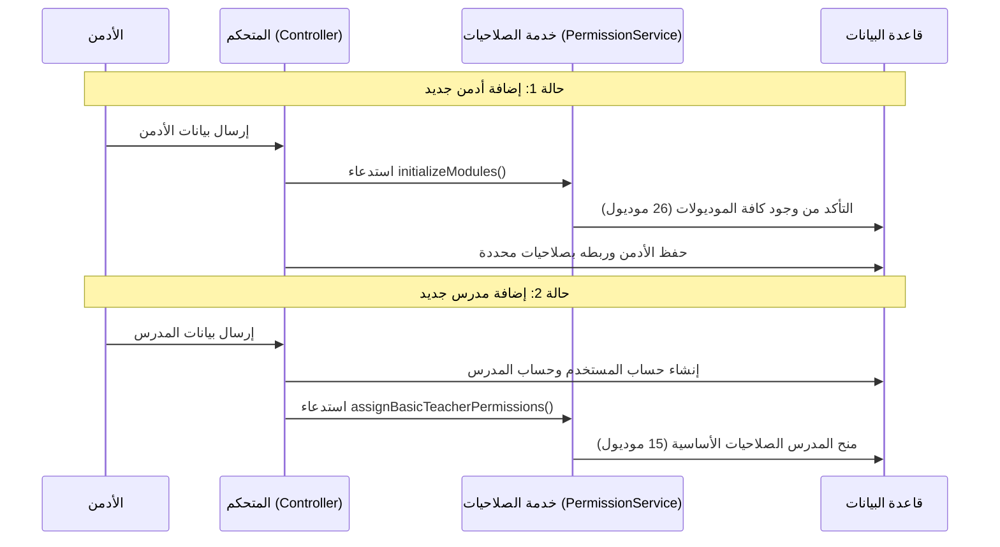

# دليل دورة حياة نظام الصلاحيات (Permissions Cycle Guide)

هذا الدليل يشرح الدورة الكاملة لكيفية عمل الصلاحيات في لوحة التحكم، بدءاً من تعريفها وصولاً إلى التحقق من حق الوصول.

## 1. هيكل النظام (The Architecture)

يعتمد النظام على ثلاث ركائز أساسية:
- **جدول `modules`**: يحتوي على المسارات البرمجية المتاحة (مثل `courses`, `exams`).
- **جدول `user_modules`**: يربط المستخدم (`user_id`) بالموديول (`module_id`) مع تحديد المدرس المسؤول (`teacher_id`).
- **خدمة `PermissionService`**: المحرك الذي يدير هذه العمليات تلقائياً.

---

## 2. الدورة الكاملة (The Full Cycle)



---

## 3. طريقة الاستخدام (Usage Guide)

### أ. عند إضافة موديول جديد في الكود
إذا قمت بإضافة صفحة جديدة في لوحة التحكم (مثلاً موديول التقارير `reports`)، كل ما عليك فعله هو:
1. فتح ملف `app/Services/PermissionService.php`.
2. إضافة الموديول الجديد في مصفوفة `getModulesList`.
3. إذا كنت تريد المدرس أن يراه، أضفه في `getTeacherBasicModules`.

### ب. كيف يتم التحقق من الصلاحية؟ (Access Control)
يتم التحقق في مكانين:

**1. الميدلوير (Middleware):**
في ملف `routes/dashboard.php` ستجد استخدام الميدلوير `checkModuleAccess`.
```php
Route::Apiresource('books', BookController::class)->middleware('checkModuleAccess:books');
```
هذا يمنع أي مستخدم (أدمن أو مدرس) من دخول الموديول إلا إذا كان موجوداً في جدول `user_modules`.

**2. داخل الكود (Logic Check):**
يمكنك التحقق برمجياً في أي مكان باستخدام موديل `User`:
```php
if (Auth::user()->canAccess('courses')) {
    // المستخدم له صلاحية
}
```

---

## 4. الموديولات المبرمجة حالياً

> [!TIP]
> **قائمة الموديولات (26):**
> تشمل كل شيء من (المستخدمين، الأدمن، الكورسات، المراجعات، المشتريات، الإحصائيات، إلخ).
>
> **صلاحيات المدرس الافتراضية (15):**
> تتركز على المحتوى التعليمي (الكورسات، الفيديوهات، الطلاب، الامتحانات، الواجبات، الإحصائيات).

---

## 5. فائدة "عيد تأسيس الصلاحيات" (Reset/Initialization)
عند إضافة أي أدمن جديد، يقوم النظام تلقائياً بتنفيذ `initializeModules`. هذه الخطوة تضمن:
1. أن قاعدة البيانات تحتوي دائماً على أحدث قائمة موديولات.
2. عدم حدوث خطأ عند محاولة ربط أدمن بموديول غير موجود في جدول `modules`.
3. إصلاح أي نقص هيدروليكي في جدول الصلاحيات إذا تم مسح بيانات منه بالخطأ.
